# [DM2025] Lab 2 – Environment Setup

Hi everyone,

We will have our second lab session (for Q&A) on **October 20th (Monday)** at **9:00 AM** via our [YouTube Stream](https://www.youtube.com/@NTHU_ISA5810_DataMining)/**Classroom**. Please be on time.

The Lab tutorial video will be launched on [YouTube Channel](https://www.youtube.com/@NTHU_ISA5810_DataMining) before **October 20th**.

We strongly recommend setting up the environment on your personal laptop before the lab session so that you can follow along smoothly.

This document provides detailed instructions for setting up the environment required for the course.

---

## System Requirements

Please make sure you have the following installed:

* **Python 3.11.0 (recommended)**
* **uv (Python virtual environment manager)**: [UV Tutorial Video](https://www.youtube.com/watch?v=6pttmsBSi8M&t=918s)
* **Git, GitHub account, *GitHub Desktop (optional)*:** [Tutorial Link for Git, GitHub & GitHub Desktop](https://www.youtube.com/watch?v=8Dd7KRpKeaE)
* **Jupyter Notebook**
* ***VS Code (optional)***
* **You need a Google account and Google's Gemini API Key:** [Get Your Gemini API Key in Google AI Studio (EASY Tutorial)](https://www.youtube.com/watch?v=RVGbLSVFtIk)
* ***Ollama for local LLM Models (optional):*** [Main website to download latest version](https://ollama.com/) | [Ollama Tutorial](https://www.youtube.com/watch?v=UtSSMs6ObqY&t=624s) | There is an extra notebook in this lab with part of our LLM exercises being solved locally with Ollama. For this 4 GB of VRAM are required (NVIDIA GPU), Kaggle or Google Colab can also be used with GPU activated.
---

## Setup Instructions

### 1. Install Python 3.11.0 (If you use your own version, take your own risk of dependency issues)

Download and install Python 3.11.0 (recommended):
https://www.python.org/downloads/release/python-3110/

During installation, check "**Add Python to PATH**".

Verify installation:

```bash
python --version
```
Expected output:
Python 3.11.0  

### 2. Create a GitHub Account and Install Git
#### Sign up for GitHub: https://github.com/  
#### Install Git:  
##### Windows: https://gitforwindows.org/  
##### Linux:

```bash
sudo apt install git-all
```
##### macOS:


```bash
brew install git
```
#### Verify installation:

```bash
git --version
```
Configure Git (replace with your GitHub username and email):
```bash
git config --global user.name "YOUR_USERNAME"
git config --global user.email "your_email@example.com"
```

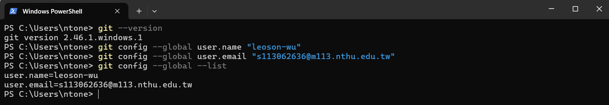

---
### 3. Fork the Repository to your GitHub Account  
Go to: [DM Lab 2](https://github.com/difersalest/DM2025-Lab2-Exercise.git) in GitHub,  
Sign in to your GitHub account  
Click "Fork" to copy it into your own GitHub account.  
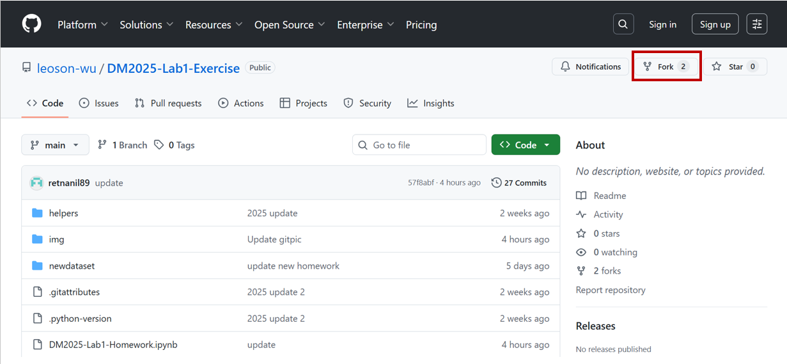

And it will redirect you to a "copy" of the repository in your own account. Once in your account (check that your name shows up at the top left corner), click the green button "Code", and the clipboard button beside the **link** that pops up. 

**Example from the previous lab:**

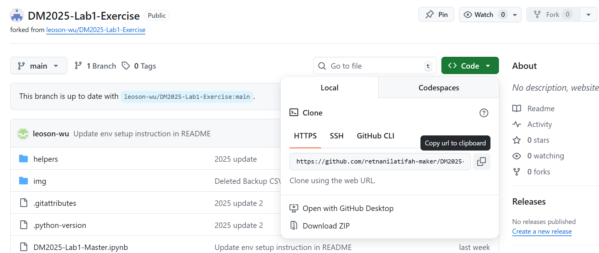

---
### 4. Create a Project Folder and Clone the Repository from your GitHub to your Project Directory   
Choose a location for your labs and create a directory:

Open a "Command Prompt" window in Windows or a "Terminal" window in macOS/Linux. Type the following commands, followed by the Enter key for each line: 

    cd \<yourpath\>

    mkdir DM2025Labs

    cd DM2025Labs

    git clone \<link you copied in the previous step\>
    
Replace \<yourpath\> by the path where you're going to store your documents. 
Below is an example, where I store my Lab in the "new" folder.

Replace \<link you copied in the previous step\> with the URL link to your own fork of the repository in your GitHub account (not the TAs one)  

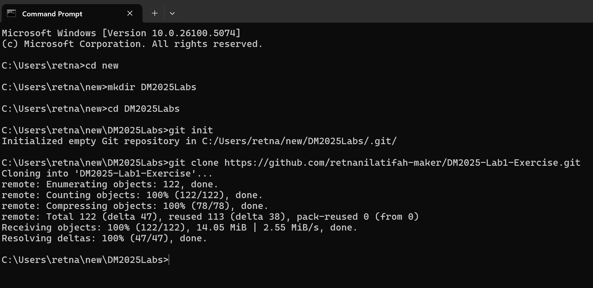

---
### 5. Install uv
[UV Tutorial Video](https://www.youtube.com/watch?v=6pttmsBSi8M&t=918s)

In terminal or PowerShell:

```bash
pip3 install uv
uv --version
```
---
### 6. Create a Virtual Environment with uv
Navigate to the project folder: `DM2025-Lab2-Exercise` and create Virtual Environment  
The Virtual Environment must be created under the project folder: `DM2025-Lab2-Exercise`  
```bash
cd <your path to the DM2025-Lab2-Exercise>
uv venv
```

This creates a .venv folder inside the project.

---
### 7. Install the Dependent Libraries

Under project folder:  `DM2025-Lab2-Exercise`  
#### Install Libraries
```bash
uv add -r requirements.txt
```
This installs all required Python packages specified in the `requirements.txt` file needed to run our lab.   
You can also install extra libraries if needed.  
```bash
uv add <library_name>
```


#### (Alternative) Using Pip and manual venv with VS Code
We suggest to use `uv` but in case you want to use `pip` you can also make the virtual environment manually, like in this tutorial: [How To Setup A Virtual Environment For Python In Visual Studio Code](https://www.youtube.com/watch?v=GZbeL5AcTgw)
After you follow the tutorial you should be able to install everything like this once inside the `venv` in the lab directory:

```bash
pip3 install -r requirements.txt
```

#### (Alternative) If you are using Google Colab   

**`The link to a Google Colab Notebook already tested is shared in section 10. Run Notebook`**.

In said notebook we specify each package in the `requirements.txt` manually like this for `Google Colab`:
```bash
!pip3 install python-dotenv==1.1.1 google-genai==1.33.0 langextract==1.0.9 gensim==4.3.3 tensorflow==2.20.0 tensorflow-hub==0.16.1 keras==3.11.3 ollama==0.5.3 langchain==0.3.27 langchain_community==0.3.29 langchain_core==0.3.75 langchain-google-genai==2.1.10 beautifulsoup4==4.13.5 chromadb==1.0.20 gradio==5.44.1 jupyter==1.1.1 scikit-learn==1.7.1 pandas==2.3.2 numpy==1.26.4 matplotlib==3.10.6 plotly==6.3.0 seaborn==0.13.2 nltk==3.9.1 umap-learn==0.5.9.post2 pymupdf==1.26.4
```
After running the cell and installing the libraries, in the output you might see a `warning`.

**You need to restart the runtime in order to use newly installed library versions.** 

Press the **"`RESTART RUNTIME`"** button. 

#### (Alternative) If you are using Kaggle

**`The link to a Kaggle Notebook already tested is shared in section 10. Run Notebook`**.

Inside said notebook in `Kaggle` the dependencies versions changed in order to work in their container.

Most of the dependencies are already installed, just run this kaggle cell there:
This is the most reliable command so far
```bash
!pip3 install chromadb langchain_community langchain_google_genai langextract ollama pymupdf
```
or run the following:
```bash
!pip3 install chromadb==1.1.0 langchain_community==0.3.29 langchain_google_genai==2.1.12 langextract==1.0.9 ollama==0.5.4 pymupdf==1.26.4
```
or run the whole list of dependencies as how they were at the time we tested the kaggle environment:
```bash
!pip3 install python-dotenv==1.1.1 google-genai==1.21.1 langextract==1.0.9 gensim==4.3.3 tensorflow==2.18.0 tensorflow-hub==0.16.1 keras==3.8.0 ollama==0.5.4 langchain==0.3.27 langchain_community==0.3.29 langchain_core==0.3.76 langchain-google-genai==2.1.12 beautifulsoup4==4.13.4 chromadb==1.1.0 gradio==5.31.0  scikit-learn==1.2.2 pandas==2.2.3 numpy==1.26.4 matplotlib==3.7.2 plotly==5.24.1 seaborn==0.12.2 nltk==3.9.1 umap-learn==0.5.7 pymupdf==1.26.4
```

In Kaggle remember to have these `Datasets` added into your notebook:

[Lab 2 necessary data from the GitHub Repository](https://www.kaggle.com/datasets/didiersalazar/lab2-initial-data)

(Explained in the next section)
[Google News Vectors](https://www.kaggle.com/datasets/didiersalazar/google-news-vectors)

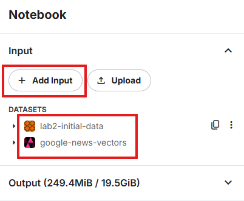


`Note: In Kaggle/Colab, Python version may differ (e.g., 3.10). Some packages could behave differently.`

---

### 8. Download a pre-trained Word2Vec model
If you are using a Jupyter Notebook or Google Colab, you can download the Google News Vector:
[Google word2vec](https://code.google.com/archive/p/word2vec/)


If you are using Kaggle Kernel, you can add this dataset to your notebook: [Kaggle | Google word2vec](https://www.kaggle.com/datasets/didiersalazar/google-news-vectors)

Copy the file into the `GoogleNews` folder of this lab and unzip it to have the `.bin` format (~3.5 GB).

---

### 9. Register Jupyter Kernel
Under project folder:  `DM2025-Lab2-Exercise`  
```bash
uv run python -m ipykernel install --user --name=dm2025lab --display-name "Python (dm2025lab)"
```

---
### 10. Run Notebook  
#### Run in VS Code
[Tutorial | Jupyter Notebook in VS Code](https://www.youtube.com/watch?v=suAkMeWJ1yE)

If using VS Code:

Open your terminal/PowerShell  
```bash
cd <your path to the DM2025-Lab2-Exercise>
code
```
Open the `DM2025-Lab2-Master.ipynb`  

Then select "Python (dm2025lab)" as the kernel in the top-right corner.  
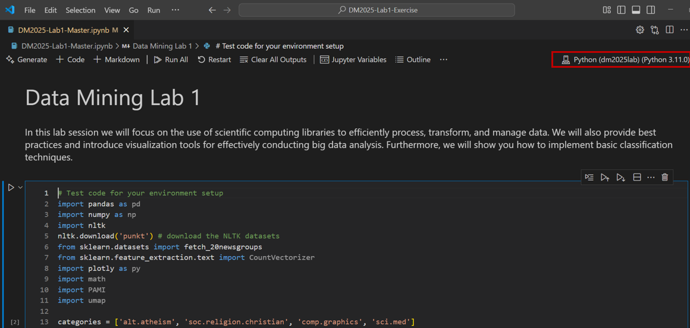  


#### (Alternative) Run Jupyter Notebook in Browser  
Start Jupyter:

```bash
cd <your path to the DM2025-Lab2-Exercise>
uv run jupyter notebook
```
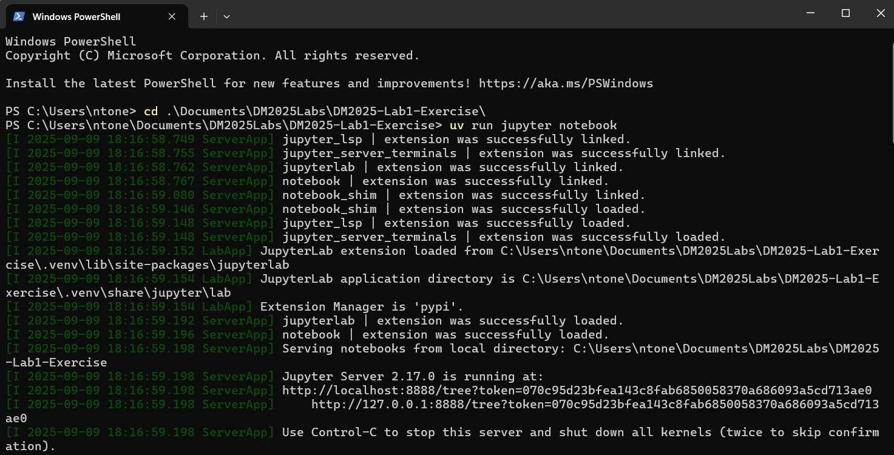

If error occurs:

```bash
python -m notebook
```  
A browser window will open.  
Open the `DM2025-Lab2-Master.ipynb` 

In the same way as in Lab 1, select **Python (dm2025lab)** as the notebook kernel on the top-right corner.  
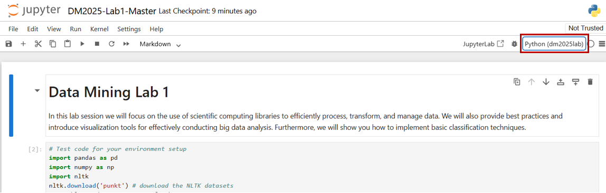

#### (Alternative) Run in Kaggle
If you cannot set up Python locally:  
Create an account: https://www.kaggle.com/  
Copy our tested Kaggle Master Notebook for Lab 2: [DM2025-Lab2-Master | Kaggle](https://www.kaggle.com/code/didiersalazar/dm2025-lab2-master)

It should look like this after you copy it: 

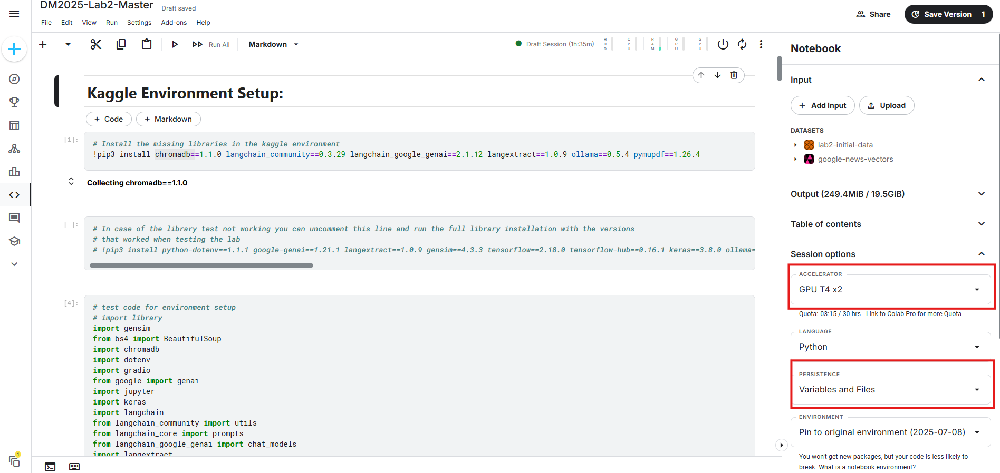

Like shown in the image above, you need to run Kaggle with `T4 GPUs`, and also select `Persistence of Variables and Files` so your data does not get reset everytime you restart a session.

#### (Alternative) Run in Google Colab
With your google account enter colab:  
Create an account: https://colab.research.google.com/  

We provide a link where you can copy the notebook of our `DM2025-Lab2-Master.ipynb` ready to run in colab: [Lab 2 Master Notebook in Google Colab](https://colab.research.google.com/drive/1bzYqhCJm1JRelPSUxf328RhJT-BC9cXc?usp=sharing)

Run Google Colab with `T4 GPU`, follow these steps:

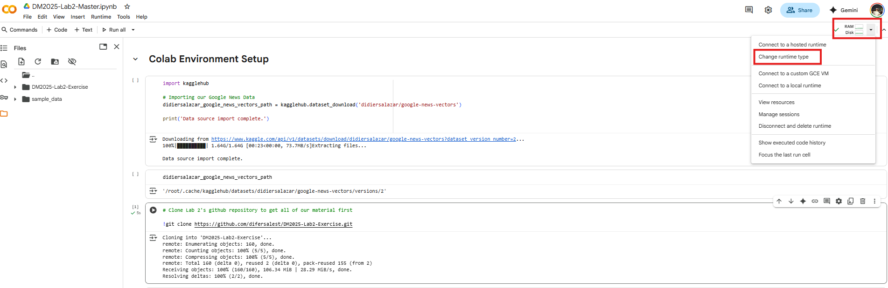

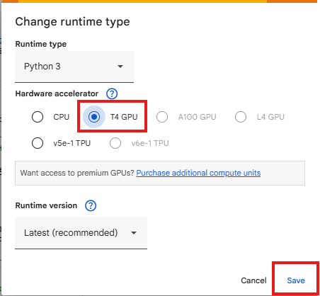

Run the setup cells first in the beginning of the notebook. The environment was tested beforehand and you should be able to run successfully all the material. If there is any problem please contact the TAs.

Just remember that google colab does not save any new data directly, every time you open the session you will need to run the cells in the beginning to get the initial data/material.

So, if you would like to save your outputs you can connect colab to your drive in this way:
```python
from google.colab import drive
drive.mount('/content/gdrive')
```
Run the code and authenticate your account, after that you can change the directories inside the notebook to your folder in google drive to save any outputs/results from the lab if you would like to have them. 

If you are interested you can check the following tutorial: [How to Read Dataset in Google Colab from Google Drive](https://www.youtube.com/watch?v=Gvwuyx_F-28)

---
### 11. Test Your Environment
Open the `DM2025-Lab2-Master.ipynb`

Paste the script below into a notebook cell and run it:

```python
# test code for environment setup
# import library
import dotenv
from google import genai
import langextract
import gensim
import tensorflow
import tensorflow_hub
import keras
import ollama
import langchain
from langchain_community import utils
from langchain_core import prompts
from langchain_google_genai import chat_models
from bs4 import BeautifulSoup
import chromadb
import gradio
import jupyter
import sklearn
import pandas
import numpy
import matplotlib
import plotly
import seaborn
import nltk
import umap
import pymupdf

%matplotlib inline

print("gensim: " + gensim.__version__)
print("tensorflow: " + tensorflow.__version__)
print("keras: " + keras.__version__)
```

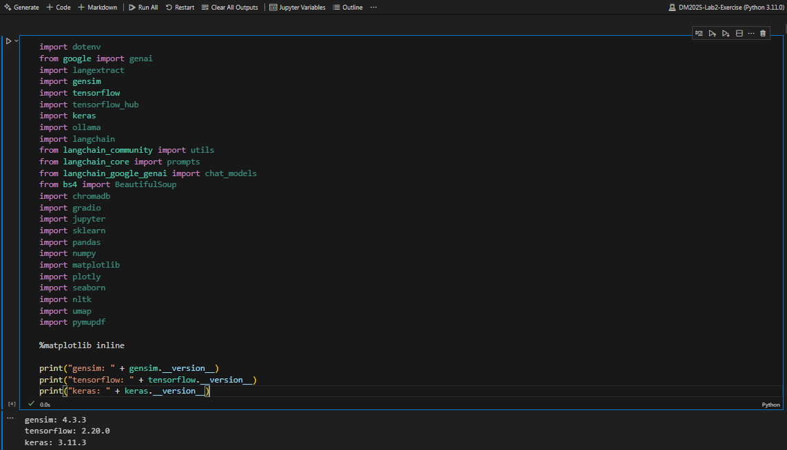

If no errors occur, your environment is ready.

### 12. Setting up our LLM Environment:

#### 12.1 Using Google's Gemini API (Required):

In this lab we will be exploring some common functions of Large Language Models (LLMs), and we will be using Google's Gemini API for it, so we need to setup some things first. Before you start the lab you need:

1. A google account (if you don't have one).
2. A Gemini's API Key: [Get Your Gemini API Key in Google AI Studio (EASY Tutorial)](https://www.youtube.com/watch?v=RVGbLSVFtIk).
3. Copy our API key into our environment. 

**Quick Definition:** If you look for documentation on how to handle API Keys in coding projects, this falls under the category of `Secrets`, because it is personal information that needs to be handled privately so others do not make use of our resources.

So first, with your google account you need to sign in into [Google AI Studio](https://aistudio.google.com/prompts/new_chat).

Follow the video tutorial cited above for this.

Inside the website we need to find the `Get API Key` button, like this:

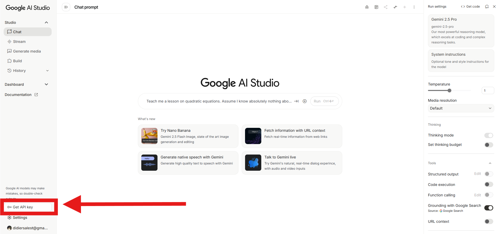

We create a new API Key and copy it from the following section: 

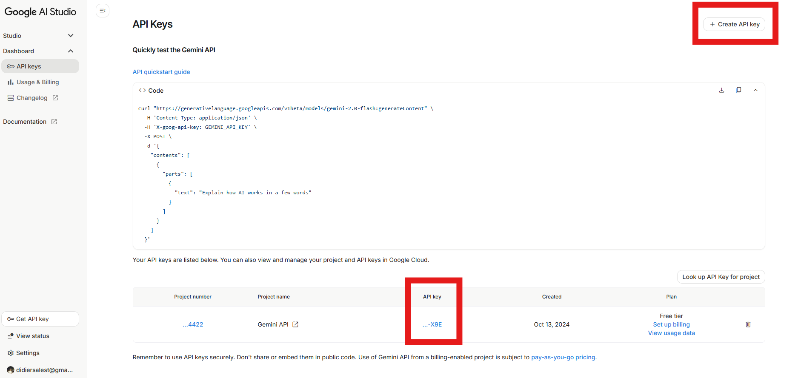

###### **Never share your API Key publicly, avoid pushing it into GitHub if you use it for other projects**.

##### 12.1.1 Local use of Google API Key:

If you are running the lab from your laptop you need to do the following: 

After you copy the API Key from Gemini, you need to go inside the `config` folder under lab 2 and create a `.env` file in this way:

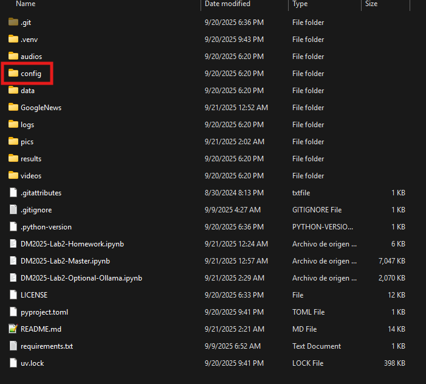

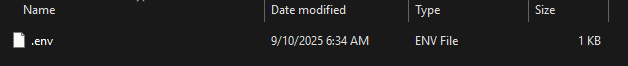

Inside the `.env` file you are gonna copy and paste the following line:

```python
GOOGLE_API_KEY = "your-api-key"
```

Change `your-api-key` text with your real API Key that you copied from Google AI Studio.

This file will never be pushed into github because it is inside the .gitignore 

To test if everything is alright you can run the following lines of code:

```python
import os
from dotenv import load_dotenv
env_path = "./config/.env"
load_dotenv(dotenv_path=env_path)

api_key = os.getenv("GOOGLE_API_KEY")
print(api_key)
```

You should see your Google API Key showing up in the print like this:

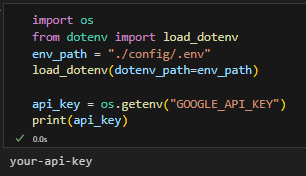

##### 12.1.2 How to handle `Secrets` in Kaggle:

You can add your Google API Key in the following way: 

1. Access your Kaggle Notebook.
2. Go to the `Add-ons` section and select `Secrets`.
3. In the right side panel click `Add Secrets`.
4. In the `LABEL` section enter `GOOGLE_API_KEY`
5. In the `VALUE` section enter your API Key.
6. Click in the toggle next to your added Secret to activate the use in the current notebook.
7. Test with the provided code if the API key can be retrieved successfully.

Follow the procedure like this:

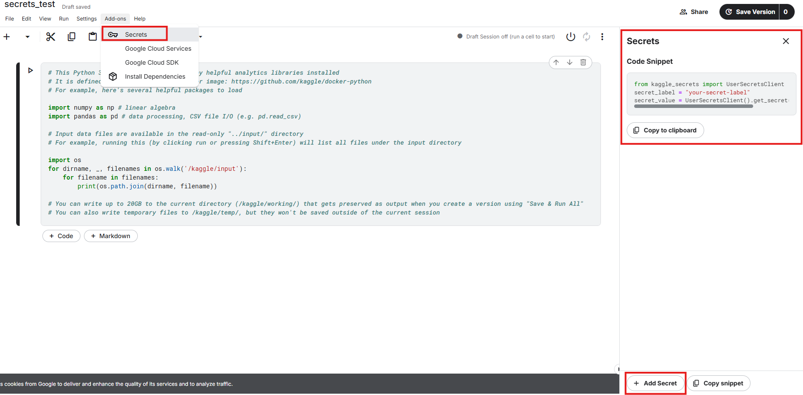

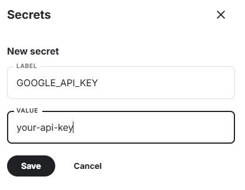

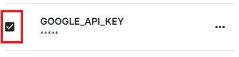

Test the following code to see if it worked:

```python
from kaggle_secrets import UserSecretsClient
secret_label = "GOOGLE_API_KEY"
secret_value = UserSecretsClient().get_secret(secret_label)
print(secret_value)
```

You should see something like this:

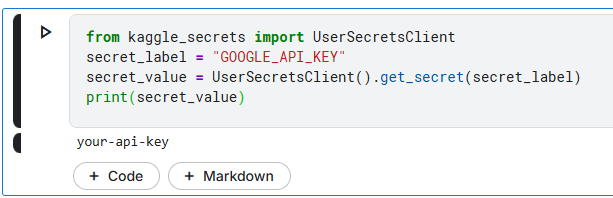


##### 12.1.3 How to handle `Secrets` in Google Colab:

You can add your Google API Key in the following way: 

1. Access your Google Colab Notebook.
2. Go to the `key` icon.
3. Press `Add new secret`.
4. Add in the name column `GOOGLE_API_KEY`.
5. Add in the value column your API key.
6. Click on the toggle next to the name column that says `Notebook access`, so your notebook can call this value.
7. You can test how to retrieve the secret with their provided code below.

To test that your secrets can be retrieved successfully use this code:
```python
from google.colab import userdata
api_key = userdata.get('GOOGLE_API_KEY')
print(api_key)
```


As you can see here:

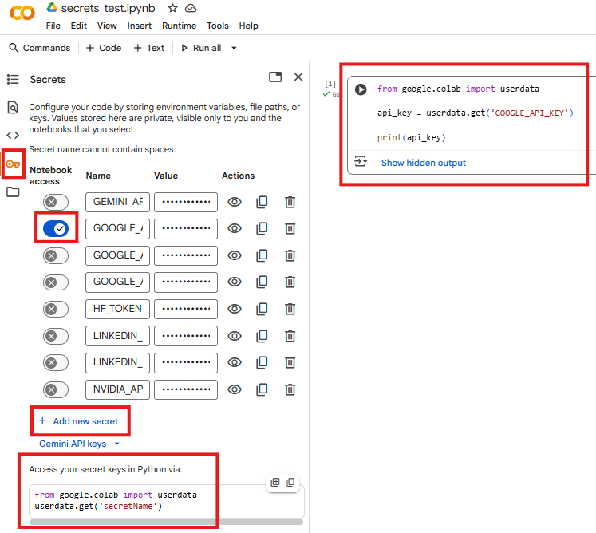

#### 12.2 Using Ollama to use Open Source LLMs (Optional):

**This part is `not worth any points`, it is just optional material if you want to learn how to use this technology**.

##### 12.2.1 Using Ollama locally:
We will be using some small open-source LLMs that will be running in your device with `Ollama`, please enter the website, download and install it in your device: [Ollama website](https://ollama.com/download)

After the installation is done, go to your terminal and type: **ollama**
You should be getting the following information if the installation was correct:

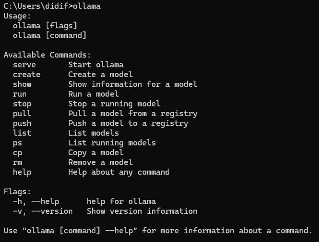

We will be using 4 Open-source LLMs here, for that it is recommended to have at least **4 GB of VRAM, 16 GB of RAM and multi-core processor** to run them in the **most optimal way**, although they can be run with less computing resources, but they will be slower in response.
To download and install them you will need to type the following commands in the terminal: 
- ollama run gemma3:4b       
    - It is a version with **4 billion parameters**. We will be using this one for multi-modal prompting with images, and for some advanced text-based tasks.
- ollama run gemma3:270m      
    - We will use this for simple text prompting, it is a small LLM model of **270 million parameters**.
- ollama run llama3.2:1b  
    - We will use this for tool calling, it is a version of **1 billion parameters**.
- ollama run embeddinggemma     
    - Model with **300 million parameters.** We will use this model to obtain text embeddings from our data.

Just for reference, GPT-4 from OpenAI has **1.8 trillion parameters**, so these are just very small models in comparison.

Feel free to explore the ollama library for other models, you can change their name in the code and re-run our provided material to compare the outputs.

After you run one of the commands the model will start to download in this way:

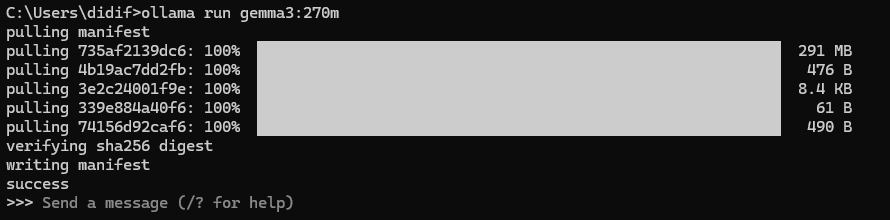

So download and install all of the models **one by one.**

After finishing you can verify each model by asking something in a prompt in the terminal: 

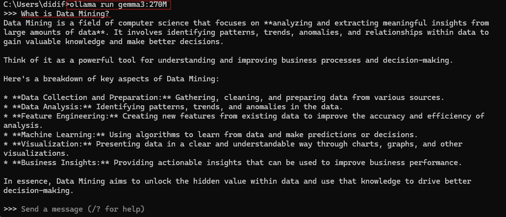

##### 12.2.1 Using Ollama on the cloud (Kaggle | Google Colab):

We also provide a tested set of notebooks to run this additional material in Kaggle and Colab: 

[Kaggle | LLM Master Examples with Ollama](https://www.kaggle.com/code/didiersalazar/dm2025-lab2-optional-ollama)

[Colab | LLM Master Examples with Ollama](https://colab.research.google.com/drive/1s8Epv5pSltFkYOwbsvHrsQuIX---R7Yi?usp=sharing)

`Enter the links, copy and run them accordingly.`

**Note that for Kaggle because the notebook size is greater than 1 Mb we cannot save a version there, only a draft, so if needed just download after you finish trying the notebook out.**

Run the notebooks with `GPU`, both Kaggle and Google Colab offer `T4 GPUs` to run notebooks. Kaggle offers 30 hrs of GPU usage every week, while Google Colab is dynamic, depends on the current available resources. Kaggle can offer more Quota if you link your account to Colab Pro.  

After this you need to run the following on the top of your notebook: 

```python
# This command installs pciutils, necessary to locate the NVIDIA GPUs in the cloud container
!apt-get install pciutils -y -qq > /dev/null 2>&1 
```

```python
#Download ollama
!curl -fsSL https://ollama.com/install.sh | sh
import subprocess
process = subprocess.Popen("ollama serve", shell=True) #runs on a different thread
```

```python
#Download model gemma3:4b
!ollama pull gemma3:4b
```

```python
#Download model llama3.2:1b
!ollama pull llama3.2:1b
```

```python
#Download model gemma3:270m
!ollama pull gemma3:270m
```

```python
#Download model embeddinggemma
!ollama pull embeddinggemma
```

Now, you can try to run the code inside `DM2025-Lab2-Optional-Ollama.ipynb`

Note that it might take some time to download and load everything in the cloud, so expect to wait 5 to 10 mins.

---
---

# Troubleshooting
Ask classmates or TAs for help before the lab if you encounter installation issues.  
If you prefer a GUI for Git, use GitHub Desktop: https://desktop.github.com/  
Good luck with the setup and see you on Monday, Oct 20th!  

---
# If everything is OK, you can start to do the lab...
---

# Save your Progress by Push 
Remember to save your notebooks. You will also have to "Push" the changes you've made in your computer to the internet. To do this, open a "Command Prompt" window in Windows or a "Terminal" window in macOS/Linux. Type the following commands followed by the Enter key: 

    cd <your path to the DM2025-Lab2-Exercise>
    git add .
    git commit -m "yourmessage"
    git push 
    
You can replace "yourmessage" with something like "Finished Ex1 and Ex2. Added graph for Ex. 6" . You can save and commit as often as you like. Below is an example:

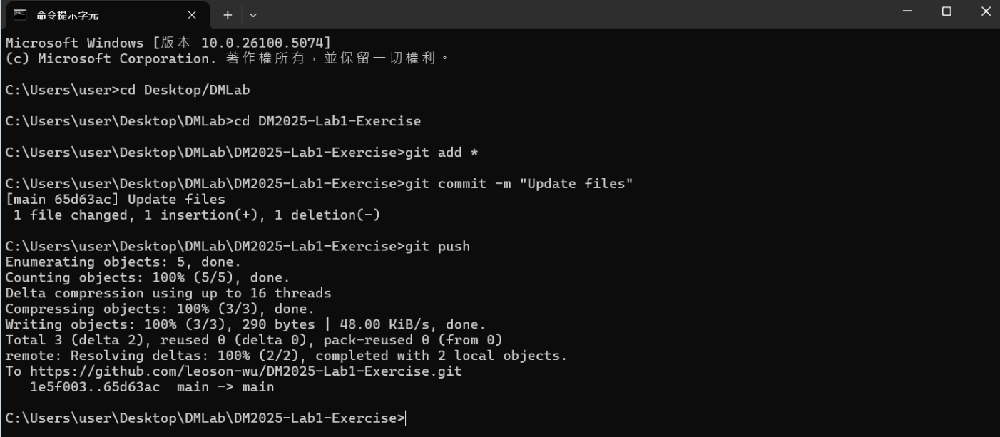

You also have the option to use GitHub Desktop, if anything happens check the tutorial: [Tutorial Link for Git, GitHub & GitHub Desktop](https://www.youtube.com/watch?v=8Dd7KRpKeaE)

# Submission Guidelines and Deadlines

Check the `DM2025-Lab2-Homework.ipynb` file for all the details.

Make sure to commit and push your changes to your GitHub repository __BEFORE the deadline for each phase__. During the second phase, the answers from the first phase will not be considered if they can not be pushed on time. For the third phase we will only consider the kaggle competition material for submission. 

Make sure your repository must contains 2 notebooks and your competition report PDF, including: 
1. `DM2025-Lab2-Master.ipynb` from [DM Lab 2 Master](https://github.com/difersalest/DM2025-Lab2-Exercise/blob/main/DM2025-Lab2-Master.ipynb)
2. `DM2025-Lab2-Homework.ipynb` from [DM Lab 2 Homework](https://github.com/difersalest/DM2025-Lab2-Exercise/blob/main/DM2025-Lab2-Homework.ipynb)
3. `competition_report.pdf` (the name of the file is arbitrary, but it must say report).

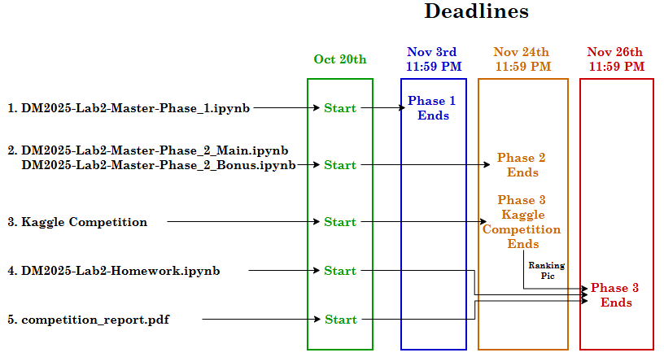

When you're done (or at any moment), find your repository link. Open the assignment page on our [NTU COOL platform](https://cool.ntu.edu.tw/login/portal). Make a submission by pasting the link to your git repository to **Lab 2 section**, we will have an assignment ready for each phase there.  

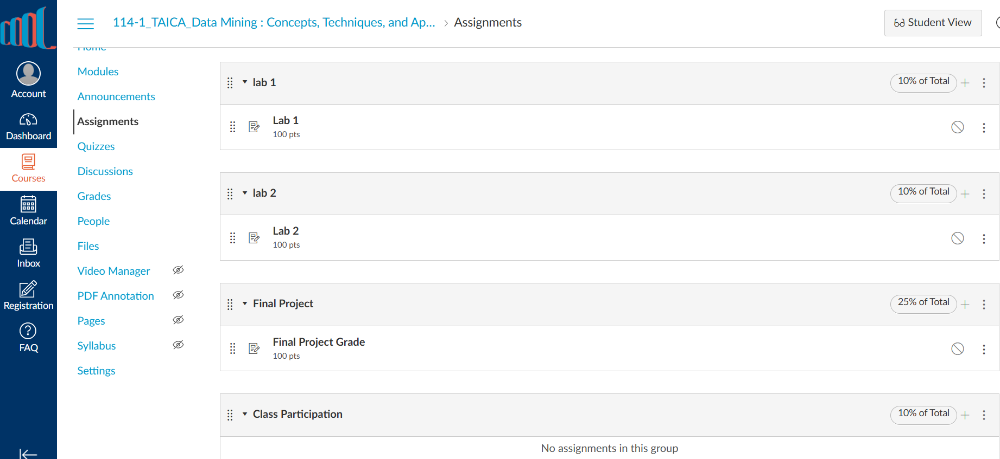

You can find your repository link by logging into [Github](https://github.com/), clicking on your profile icon on the upper right corner, selecting "Your repositories", and clicking on the name of your repository. Then copy the link in your browser.  

Again, __we will not consider pushes made after the deadline__. 

That's it! We wish you Good luck!


